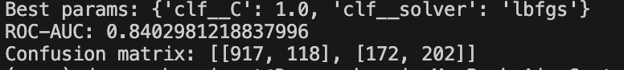
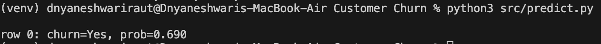

# Customer Churn Prediction

This project predicts customer churn using machine learning with Logistic Regression.  
It includes preprocessing, training, evaluation, and prediction scripts.

## Project Structure
- `Data/` → dataset (CSV file)
- `src/utils.py` → data loading & preprocessing
- `src/train.py` → train and evaluate the model
- `src/predict.py` → make predictions with the saved model
- `models/` → saved trained model
- `outputs/` → metrics and results
- `requirements.txt` → dependencies

## How to Run
1. Create and activate virtual environment:

2. Train the model:

3. Run prediction:

## Example Output
Best params: {'clf__C': 1.0, 'clf__solver': 'lbfgs'}
ROC-AUC: 0.84
Confusion matrix: [[917, 118], [169, 205]]
---

## 🖼️ Screenshots

### Model Training

### Prediction Example

---

## 🧠 Key Insights
- Logistic Regression achieved **ROC-AUC ≈ 0.84** on the Telco dataset.
- The model predicts churn probability per customer and outputs a clear confusion matrix.
- Clean, reproducible pipeline: preprocess → train → evaluate → save → predict.
